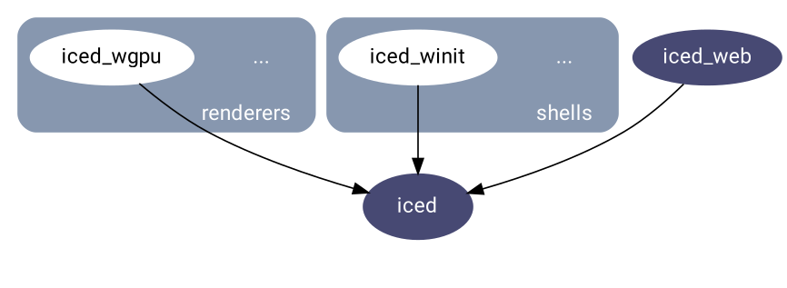

# Ecosystem
This document describes the Iced ecosystem and explains how the different crates relate to each other.

## Overview
Iced is meant to be used by 2 different types of users:

- __End-users__. They should be able to:
  - get started quickly,
  - have many widgets available,
  - keep things simple,
  - and build applications that are __maintainable__ and __performant__.
- __GUI toolkit developers / Ecosystem contributors__. They should be able to:
  - build new kinds of widgets,
  - implement custom runtimes,
  - integrate existing runtimes in their own system (like game engines),
  - and create their own custom renderers.

Iced consists of different crates which offer different layers of abstractions for our users. This modular architecture helps us keep implementation details hidden and decoupled, which should allow us to rewrite or change strategies in the future.

  

## The foundations
There are a bunch of concepts that permeate the whole ecosystem. These concepts are considered __the foundations__, and they are provided by three different crates:

- [`iced_core`] contains many lightweight, reusable primitives (e.g. `Point`, `Rectangle`, `Color`).
- [`iced_futures`] implements the concurrent concepts of [The Elm Architecture] on top of the [`futures`] ecosystem.
- [`iced_style`] defines the default styling capabilities of built-in widgets.

  

## The native target
The native side of the ecosystem is split into two different groups: __renderers__ and __shells__.

  

### Renderers
The widgets of a _graphical_ user interface produce some primitives that eventually need to be drawn on screen. __Renderers__ take care of this task, potentially leveraging GPU acceleration.

Currently, there are two different official renderers:

- [`iced_wgpu`] is powered by [`wgpu`] and supports Vulkan, DirectX 12, and Metal.
- [`iced_glow`] is powered by [`glow`] and supports OpenGL 3.3+.

Additionally, the [`iced_graphics`] subcrate contains a bunch of backend-agnostic types that can be leveraged to build renderers. Both of the renderers rely on the graphical foundations provided by this crate.

### Shells
The widgets of a graphical user _interface_ are interactive. __Shells__ gather and process user interactions in an event loop.

Normally, a shell will be responsible of creating a window and managing the lifecycle of a user interface, implementing a runtime of [The Elm Architecture].

As of now, there are two official shells:

- [`iced_winit`] implements a shell runtime on top of [`winit`].
- [`iced_glutin`] is similar to [`iced_winit`], but it also deals with [OpenGL context creation].

## The web target
The Web platform provides all the abstractions necessary to draw widgets and gather users interactions.

Therefore, unlike the native path, the web side of the ecosystem does not need to split renderers and shells. Instead, [`iced_web`] leverages [`dodrio`] to both render widgets and implement a proper runtime.

## Iced
Finally, [`iced`] unifies everything into a simple abstraction to create cross-platform applications:

- On native, it uses __[shells](#shells)__ and __[renderers](#renderers)__.
- On the web, it uses [`iced_web`].

  

[`iced_core`]: core
[`iced_futures`]: futures
[`iced_style`]: style
[`iced_native`]: native
[`iced_web`]: web
[`iced_graphics`]: graphics
[`iced_wgpu`]: wgpu
[`iced_glow`]: glow
[`iced_winit`]: winit
[`iced_glutin`]: glutin
[`iced`]: ..
[`futures`]: https://github.com/rust-lang/futures-rs
[`glow`]: https://github.com/grovesNL/glow
[`wgpu`]: https://github.com/gfx-rs/wgpu-rs
[`winit`]: https://github.com/rust-windowing/winit
[`glutin`]: https://github.com/rust-windowing/glutin
[`dodrio`]: https://github.com/fitzgen/dodrio
[OpenGL context creation]: https://www.khronos.org/opengl/wiki/Creating_an_OpenGL_Context
[The Elm Architecture]: https://guide.elm-lang.org/architecture/
