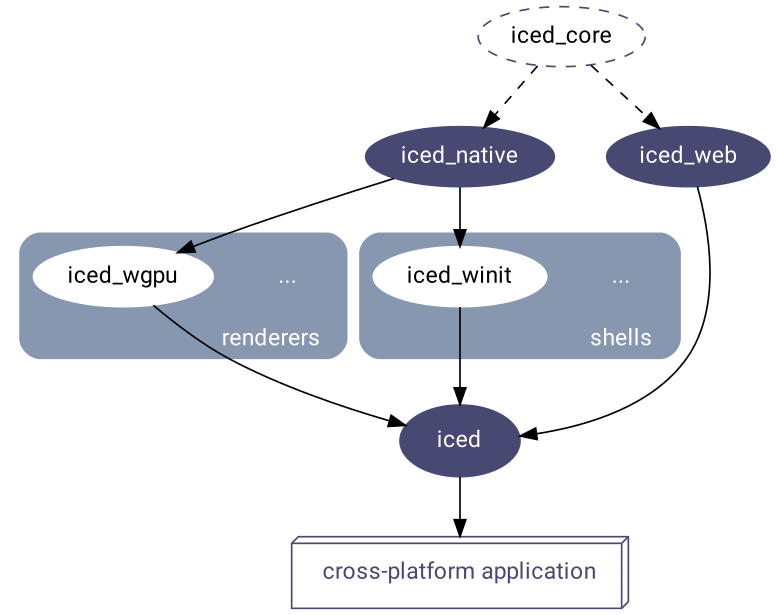

<div align="center">


# Iced

[][documentation]
[](https://crates.io/crates/iced)
[](https://github.com/iced-rs/iced/blob/master/LICENSE)
[](https://crates.io/crates/iced)
[](https://github.com/iced-rs/iced/actions)
[](https://discord.gg/3xZJ65GAhd)

A cross-platform GUI library for Rust focused on simplicity and type-safety.
Inspired by [Elm].

<a href="https://gfycat.com/littlesanehalicore">
  
</a>
<a href="https://gfycat.com/politeadorableiberianmole">
  
</a>

</div>

## Features

* Simple, easy-to-use, batteries-included API
* Type-safe, reactive programming model
* [Cross-platform support] (Windows, macOS, Linux, and [the Web])
* Responsive layout
* Built-in widgets (including [text inputs], [scrollables], and more!)
* Custom widget support (create your own!)
* [Debug overlay with performance metrics]
* First-class support for async actions (use futures!)
* [Modular ecosystem] split into reusable parts:
  * A [renderer-agnostic native runtime] enabling integration with existing systems
  * Two [built-in renderers] leveraging [`wgpu`] and [`tiny-skia`]
    * [`iced_wgpu`] supporting Vulkan, Metal and DX12
    * [`iced_tiny_skia`] offering a software alternative as a fallback
  * A [windowing shell]
  * A [web runtime] leveraging the DOM

__Iced is currently experimental software.__ [Take a look at the roadmap],
[check out the issues], and [feel free to contribute!]

[Cross-platform support]: https://raw.githubusercontent.com/iced-rs/iced/master/docs/images/todos_desktop.jpg
[the Web]: https://github.com/iced-rs/iced_web
[text inputs]: https://gfycat.com/alertcalmcrow-rust-gui
[scrollables]: https://gfycat.com/perkybaggybaboon-rust-gui
[Debug overlay with performance metrics]: https://gfycat.com/incredibledarlingbee
[Modular ecosystem]: ECOSYSTEM.md
[renderer-agnostic native runtime]: native/
[`wgpu`]: https://github.com/gfx-rs/wgpu
[`tiny-skia`]: https://github.com/RazrFalcon/tiny-skia
[`iced_wgpu`]: wgpu/
[`iced_tiny_skia`]: tiny_skia/
[built-in renderers]: ECOSYSTEM.md#Renderers
[windowing shell]: winit/
[`dodrio`]: https://github.com/fitzgen/dodrio
[web runtime]: https://github.com/iced-rs/iced_web
[Take a look at the roadmap]: ROADMAP.md
[check out the issues]: https://github.com/iced-rs/iced/issues
[feel free to contribute!]: #contributing--feedback

## Installation

Add `iced` as a dependency in your `Cargo.toml`:

```toml
iced = "0.10"
```

If your project is using a Rust edition older than 2021, then you will need to
set `resolver = "2"` in the `[package]` section as well.

__Iced moves fast and the `master` branch can contain breaking changes!__ If
you want to learn about a specific release, check out [the release list].

[the release list]: https://github.com/iced-rs/iced/releases

## Overview

Inspired by [The Elm Architecture], Iced expects you to split user interfaces
into four different concepts:

* __State__ — the state of your application
* __Messages__ — user interactions or meaningful events that you care
  about
* __View logic__ — a way to display your __state__ as widgets that
  may produce __messages__ on user interaction
* __Update logic__ — a way to react to __messages__ and update your
  __state__

We can build something to see how this works! Let's say we want a simple counter
that can be incremented and decremented using two buttons.

We start by modelling the __state__ of our application:

```rust
struct Counter {
    // The counter value
    value: i32,
}
```

Next, we need to define the possible user interactions of our counter:
the button presses. These interactions are our __messages__:

```rust
#[derive(Debug, Clone, Copy)]
pub enum Message {
    IncrementPressed,
    DecrementPressed,
}
```

Now, let's show the actual counter by putting it all together in our
__view logic__:

```rust
use iced::widget::{button, column, text, Column};

impl Counter {
    pub fn view(&self) -> Column<Message> {
        // We use a column: a simple vertical layout
        column![
            // The increment button. We tell it to produce an
            // `IncrementPressed` message when pressed
            button("+").on_press(Message::IncrementPressed),

            // We show the value of the counter here
            text(self.value).size(50),

            // The decrement button. We tell it to produce a
            // `DecrementPressed` message when pressed
            button("-").on_press(Message::DecrementPressed),
        ]
    }
}
```

Finally, we need to be able to react to any produced __messages__ and change our
__state__ accordingly in our __update logic__:

```rust
impl Counter {
    // ...

    pub fn update(&mut self, message: Message) {
        match message {
            Message::IncrementPressed => {
                self.value += 1;
            }
            Message::DecrementPressed => {
                self.value -= 1;
            }
        }
    }
}
```

And that's everything! We just wrote a whole user interface. Iced is now able
to:

  1. Take the result of our __view logic__ and layout its widgets.
  1. Process events from our system and produce __messages__ for our
     __update logic__.
  1. Draw the resulting user interface.

Browse the [documentation] and the [examples] to learn more!

## Implementation details

Iced was originally born as an attempt at bringing the simplicity of [Elm] and
[The Elm Architecture] into [Coffee], a 2D game engine I am working on.

The core of the library was implemented during May 2019 in [this pull request].
[The first alpha version] was eventually released as
[a renderer-agnostic GUI library]. The library did not provide a renderer and
implemented the current [tour example] on top of [`ggez`], a game library.

Since then, the focus has shifted towards providing a batteries-included,
end-user-oriented GUI library, while keeping [the ecosystem] modular:

<p align="center">
  <a href="ECOSYSTEM.md">
    
  </a>
</p>

[this pull request]: https://github.com/hecrj/coffee/pull/35
[The first alpha version]: https://github.com/iced-rs/iced/tree/0.1.0-alpha
[a renderer-agnostic GUI library]: https://www.reddit.com/r/rust/comments/czzjnv/iced_a_rendereragnostic_gui_library_focused_on/
[tour example]: examples/README.md#tour
[`ggez`]: https://github.com/ggez/ggez
[the ecosystem]: ECOSYSTEM.md

## Contributing / Feedback

Contributions are greatly appreciated! If you want to contribute, please
read our [contributing guidelines] for more details.

Feedback is also welcome! You can open a discussion or come chat to our
[Discord server]. 

## Sponsors

The development of Iced is sponsored by the [Cryptowatch] team at [Kraken.com]

[documentation]: https://docs.rs/iced/
[examples]: https://github.com/iced-rs/iced/tree/master/examples
[Coffee]: https://github.com/hecrj/coffee
[Elm]: https://elm-lang.org/
[The Elm Architecture]: https://guide.elm-lang.org/architecture/
[the current issues]: https://github.com/iced-rs/iced/issues
[contributing guidelines]: https://github.com/iced-rs/iced/blob/master/CONTRIBUTING.md
[Discord server]: https://discord.gg/3xZJ65GAhd
[Rust Community Discord]: https://bit.ly/rust-community
[Cryptowatch]: https://cryptowat.ch/charts
[Kraken.com]: https://kraken.com/
