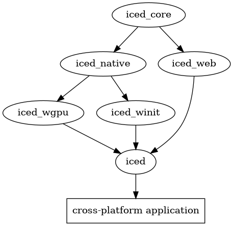

# Roadmap
This document describes the current state of Iced and some of the most important next steps we should take before it can become a production-ready GUI library.

## Context
Before we get into the actual roadmap, let's quickly review what is the current state of the library.

### Users

Iced is meant to be used by 2 different types of users:

- __End-users__. They should be able to:
  - get started quickly,
  - have many widgets available,
  - keep things simple,
  - and build applications that are __maintainable__ and __performant__.
- __GUI toolkit developers / Ecosystem contributors__. They should be able to:
  - build new kinds of widgets,
  - implement custom runtimes,
  - integrate existing runtimes in their own system (like game engines),
  - and create their own custom renderers.

### Current state
Iced consists of different crates which offer different layers of abstractions for our users. This modular architecture helps us keep implementation details hidden and decoupled, which should allow us to rewrite or change strategies in the future.



#### `iced_core`

`iced_core` holds most of the reusable types of the public API. For instance, common widgets (like `Column`, `Row`, `Button`...) and basic data types (`Point`, `Rectangle`, `Length`...).

This crate is meant to be a starting point for an Iced runtime.

#### `iced_native`
`iced_native` takes `iced_core` and builds a native runtime on top of it, featuring:
- A flexbox-based layout engine, powered by [`stretch`]
- Event handling for all the built-in widgets
- A renderer-agnostic API

To achieve this, it introduces a bunch of reusable interfaces:
- A `Widget` trait, which is used to implement new widgets: from layout requirements to event and drawing logic.
- A bunch of `Renderer` traits, meant to keep the crate renderer-agnostic.
- A `Windowed` trait, which can be implemented by graphical renderers that target _windows_. Window-based runtimes can use this trait to stay renderer-agnostic.

[`stretch`]: https://github.com/vislyhq/stretch

#### `iced_web`
`iced_web` takes `iced_core` and builds a WebAssembly runtime on top. It achieves this by introducing a `Widget` trait that can be used to produce VDOM nodes.

The crate is a quite simple abstraction layer over [`dodrio`].

[`dodrio`]: https://github.com/fitzgen/dodrio

#### `iced_wgpu`
`iced_wgpu` is a [`wgpu`] renderer for `iced_native`. It is meant to become the default renderer of Iced in native platforms.

[`wgpu`] supports most modern graphics backends: Vulkan, Metal, DX11, and DX12 (OpenGL and WebGL are still WIP). Additionally, it will support the incoming [WebGPU API].

Currently, `iced_wgpu` only supports a couple of primitives:
- Text, which is rendered using [`wgpu_glyph`].
- Quads or rectangles, with rounded borders and a solid background color.

[`wgpu`]: https://github.com/gfx-rs/wgpu-rs
[WebGPU API]: https://gpuweb.github.io/gpuweb/
[`wgpu_glyph`]: https://github.com/hecrj/wgpu_glyph

#### `iced_winit`
`iced_winit` offers some convenient abstractions on top of `iced_native` to quickstart development when using [`winit`].

It exposes a renderer-agnostic `Application` trait that can be implemented and then run with a simple call. The use of this trait is optional. A `conversion` module is provided for users that decide to implement a custom event loop.

[`winit`]: https://github.com/rust-windowing/winit

#### `iced`
Finally, `iced` unifies everything into a simple abstraction to create cross-platform applications:

- On native, it uses `iced_winit` and `iced_wgpu`.
- On the web, it uses `iced_web`.

This is the crate meant to be used by __end-users__.


## Next steps
This section describes some important features that should be implemented before Iced can be considered production-ready (before a 1.0 release).

Most of the work related to these features needs to happen in the `iced_native` path of the ecosystem, as the web already supports many of them.

### Scrollables / Clippables
Content that can take a (practically) infinite amount of space and can be viewed using a scrollbar. This is a very basic feature.

The end-user API could look like this:

```rust
Column::new()
    .push(content)
    .scroll(&mut self.scroll_state);
```

The challenge here is __composability__. Nested scrollables should work as expected.

When it comes to `iced_native`, we may need to add the concept of _event propagation_, so mouse wheel events can be captured by the inner-most scrollable and stop propagation.

When it comes to `iced_wgpu`, we should be able to use scissoring and transformations. [`wgpu`] has a [`RenderPass::set_scissor_rect`] that should work nicely.

The main issue here will be [`wgpu_glyph`], which is used currently to render text primitives. [`wgpu_glyph`] is powered by [`glyph-brush`], which caches glyphs to render text very fast. However, the current cache model does not seem to be composable (i.e. once you issue a draw call the cache is purged). We will need to change it (and potentially contribute) to accommodate for this use case.

[`RenderPass::set_scissor_rect`]: https://docs.rs/wgpu/0.3.0/src/wgpu/lib.rs.html#1246-1248
[`glyph-brush`]: https://github.com/alexheretic/glyph-brush

### Text input widget
A widget where the user can type raw text and passwords.

This widget will have a quite complex event logic, potentially coupled with text rendering. Some examples are:
- Text cursor positioning based on a mouse click
- Text selection
- Clipboard interaction (copy & paste)
- Text editing shortcuts (go to start, go to end, etc.)

It also needs scrollable / clippable text support, as the introduced text may not fit the input and scrolling based on the text cursor will need to be implemented.

Additionally, the text cursor should blink at a regular interval, which can be considered an _animation_.

I think we should start simple here, and build a text widget with the most basic functionality: click to focus and type to fill. We can improve the implementation with time as the library matures.

The end-user API could look like this:

```rust
pub enum Message {
    TextChanged(String),
}

let text_input = text_input::State::new();
let text = "Hello";

TextInput::new(&mut text_input, &text, Message::TextChanged);
```

### TodoMVC example
Once we have scrollables support and a text widget, we could build a [TodoMVC] example. It seems to be a very simple example and could showcase the API quite well.

We could also consider releasing a `0.1.0` version at this point and share it as a milestone on different social platforms.

[TodoMVC]: http://todomvc.com/

### Multi-window support
Open and control multiple windows at runtime.

I think this could be achieved by implementing an additional trait in `iced_winit` similar to `Application` but with a slightly different `view` method, allowing users to control what is shown in each window.

This approach should also allow us to perform custom optimizations for this particular use case.

### Async actions
Most applications need to perform work in the background, without freezing the UI while they work. The current architecture can be easily extended to achieve this.

We can let users return an asynchronous action (i.e. a future) producing a `Message` in `Application::update`. The runtime will spawn each returned action in a thread pool and, once it finishes, feed the produced message back to `update`. This is also how [Elm] does it.

When it comes to implementing this, [`winit`] already supports user-specific events that can be sent from another thread. Accommodating `iced_winit` for this functionality should not be too complicated.

[Elm]: https://elm-lang.org/

Here is an example of how the end-user API could look:

```rust
impl Application for WeatherReport {
    fn update(&mut self, message: Message) -> Command<Message> {
        match message {
            Message::Refresh => {
                self.state = State::Loading;

                Command::from_future(
                    Weather::request(self.location),
                    Message::ReportReceived,
                )
            }
            Message::ReportReceived(Ok(report)) => {
                self.state = State::Show(report);

                Command::none()
            },
            Message::ReportReceived(Err(error)) => {
                self.state = State::Error(error);

                Command::none()
            }
        }
    }
}
```

### Event subscriptions
Besides performing async actions on demand, most applications also need to listen to events passively. An example of this could be a WebSocket connection, where messages can come in at any time.

The idea here is to also follow [Elm]'s footsteps. We can add a method `subscriptions(&self) -> Subscription<Message>` to `Application` and keep the subscriptions alive in the runtime.

The challenge here is designing the public API of subscriptions. Ideally, users should be able to create their own subscriptions and the GUI runtime should keep them alive by performing _subscription diffing_ (i.e. detecting when a subscription is added, changed, or removed). For this, we can take a look at [Elm] for inspiration.

### Layers
Currently, Iced assumes widgets cannot be laid out on top of each other. We should implement support for multiple layers of widgets.

This is a necessary feature to implement many kinds of interactables, like dropdown menus, select fields, etc.

`iced_native` will need to group widgets to perform layouting and process some events first for widgets positioned on top.

`iced_wgpu` will also need to process the scene graph and sort draw calls based on the different layers.

### Animations
Allow widgets to request a redraw at a specific time.

This is a necessary feature to render loading spinners, a blinking text cursor, GIF images, etc.

[`winit`] allows flexible control of its event loop. We may be able to use [`ControlFlow::WaitUntil`](https://docs.rs/winit/0.20.0-alpha3/winit/event_loop/enum.ControlFlow.html#variant.WaitUntil) for this purpose.

### Canvas widget
A widget to draw freely in 2D or 3D. It could be used to draw charts, implement a Paint clone, a CAD application, etc.

As a first approach, we could expose the underlying renderer directly here, and couple this widget with it ([`wgpu`] for now). Once [`wgpu`] gets WebGL or WebGPU support, this widget will be able to run on the web too. The renderer primitive could be a simple texture that the widget draws to.

In the long run, we could expose a renderer-agnostic abstraction to perform the drawing.

### Text shaping and font fallback
[`wgpu_glyph`] uses [`glyph-brush`], which in turn uses [`rusttype`]. While the current implementation is able to layout text quite nicely, it does not perform any [text shaping].

[Text shaping] with font fallback is a necessary feature for any serious GUI toolkit. It unlocks support to truly localize your application, supporting many different scripts.

The only available library that does a great job at shaping is [HarfBuzz], which is implemented in C++. [`skribo`] seems to be a nice [HarfBuzz] wrapper for Rust.

This feature will probably imply rewriting [`wgpu_glyph`] entirely, as caching will be more complicated and the API will probably need to ask for more data.

[`rusttype`]: https://github.com/redox-os/rusttype
[text shaping]: https://en.wikipedia.org/wiki/Complex_text_layout
[HarfBuzz]: https://github.com/harfbuzz/harfbuzz
[`skribo`]: https://github.com/linebender/skribo

### Grid layout and text layout
Currently, `iced_native` only supports flexbox items. For instance, it is not possible to create a grid of items or make text float around an image.

We will need to enhance the layouting engine to support different strategies and improve the way we measure text to lay it out in a more flexible way.


## Ideas that may be worth exploring

### Reuse existing 2D renderers
While I believe [`wgpu`] has a great future ahead of it, implementing `iced_wgpu` and making it performant will definitely be a challenge.

We should keep an eye on existing 2D graphic libraries, like [`piet`] or [`pathfinder`], and give them a try once/if they mature a bit more.

The good news here is that most of Iced is renderer-agnostic, so changing the rendering strategy, if we deem it worth it, should be really easy. Also, a 2D graphics library will expose a higher-level API than [`wgpu`], so implementing a new renderer on top of it should be fairly straightforward.

[`piet`]: https://github.com/linebender/piet
[`pathfinder`]: https://github.com/servo/pathfinder

### Remove explicit state handling and lifetimes
Currently, `iced_native` forces users to provide the local state of each widget. While this could be considered a really pure form of describing a GUI, it makes some optimizations harder because of the borrow checker.

The current borrow checker is not able to detect a drop was performed before reassigning a value to a mutable variable. Thus, keeping the generated widgets in `Application::view` alive between iterations of the event loop is not possible, which forces us to call this method quite often. `unsafe` could be used to workaround this, but it would feel fishy.

We could take a different approach, and keep some kind of state tree decoupled from the actual widget definitions. This would force us to perform diffing of nodes, as the widgets will represent the desired state and not the whole state.

Once the state lifetime of widgets is removed, we could keep them alive between iterations and even make `Application::view` take a non-mutable reference. This would also improve the end-user API, as it will not be necessary to constantly provide mutable state to widgets.

This is a big undertaking and introduces a new set of problems. We should research and consider the implications of this approach in detail before going for it.

### Improve style definitions
As of now, each widget defines its own styling options with methods, following the builder pattern.

A unified way of defining and reusing styles would be great. I think we must avoid replicating CSS, we should try to stay as type-safe, explicit, and intuitive as possible.

I think many different ideas in [`elm-ui`] could serve as an inspiration.

[`elm-ui`]: https://www.youtube.com/watch?v=Ie-gqwSHQr0

### Try a different font rasterizer
[`wgpu_glyph`] depends indirectly on [`rusttype`]. We may be able to gain performance by using a different font rasterizer. [`fontdue`], for instance, has reported noticeable speedups.

[`fontdue`]: https://github.com/mooman219/fontdue

### Connect `iced_web` with `web-view`
It may be interesting to try to connect `iced_web` with [`web-view`]. It would give users a feature-complete renderer for free, and applications would still be leaner than with Electron.

[`web-view`]: https://github.com/Boscop/web-view

### Implement a lazy widget
Once we remove state lifetimes from widgets, we should be able to implement a widget storing a function that generates additional widgets. The runtime would then be able to control when to call this function and cache the generated widgets while some given value does not change.

This could be very useful to build very performant user interfaces with a lot of different items.

[Elm does it very well!](https://guide.elm-lang.org/optimization/lazy.html)

### Build a custom layout engine
It may be possible to build an optimized layout engine only for `iced_native` if it turns out that there are some flexbox features we end up not using.
