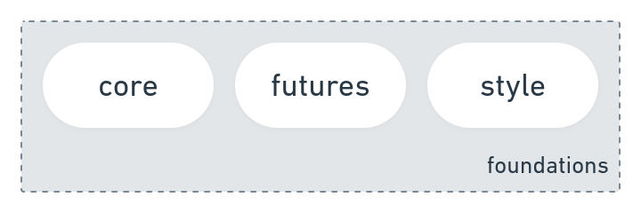

# `iced_core`
[][documentation]

`iced_core` holds basic reusable types of the public API. For instance, basic data types like `Point`, `Rectangle`, `Length`, etc.

This crate is meant to be a starting point for an Iced runtime.

  

[documentation]: https://docs.rs/iced_core
