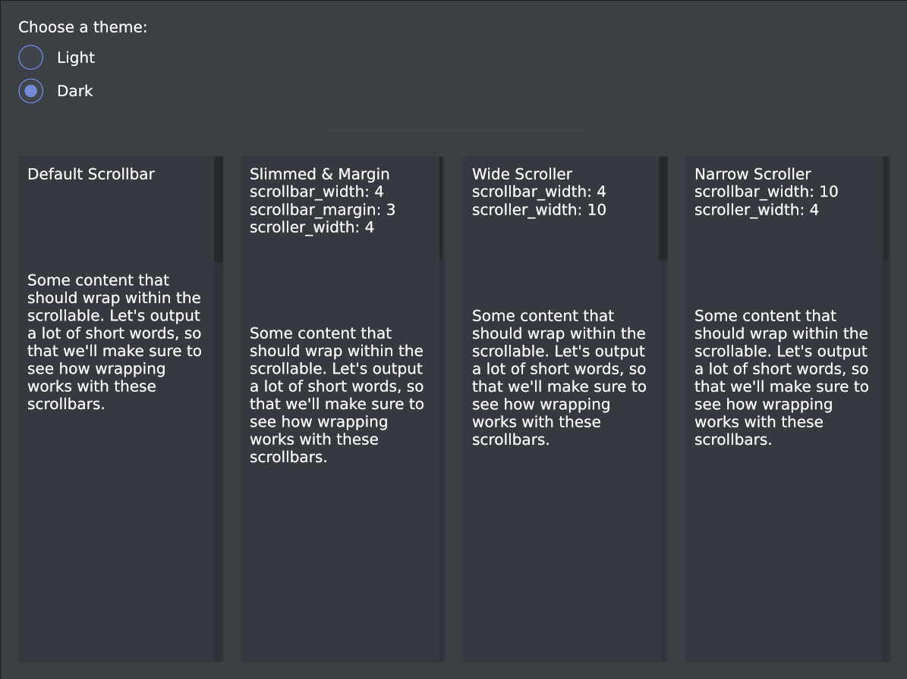

# Scrollable
An example showcasing the various size and style options for the Scrollable.

All the example code is located in the __[`main`](src/main.rs)__ file.

This was done very quickly. Its very ugly right now.
I will create an RFC for this and cleanup the source.

<!-- <div align="center">
  <a href="screenshot.png">
    
  </a>
</div> -->

You can run it with `cargo run`:
```
cargo run  --package keyboard_navigation
```

Tab navigation between widgets
Space, Enter, NumEnter will activate the widget as expected
Slider will toggle grabbing when you activate. I find this to be best case with sliders and keyboard / gamepad inputs.

