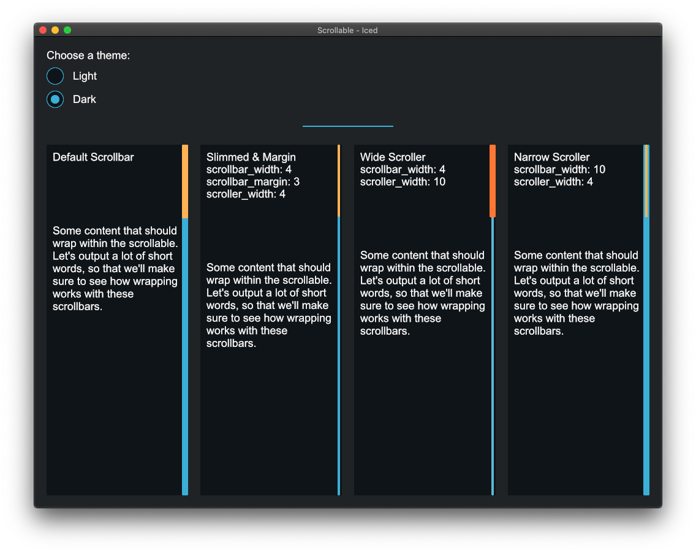

# Scrollable
An example showcasing the various size and style options for the Scrollable.

All the example code is located in the __[`main`](src/main.rs)__ file.

<div align="center">
  <a href="screenshot.png">
    
  </a>
</div>

You can run it with `cargo run`:
```
cargo run --package scrollable
```
