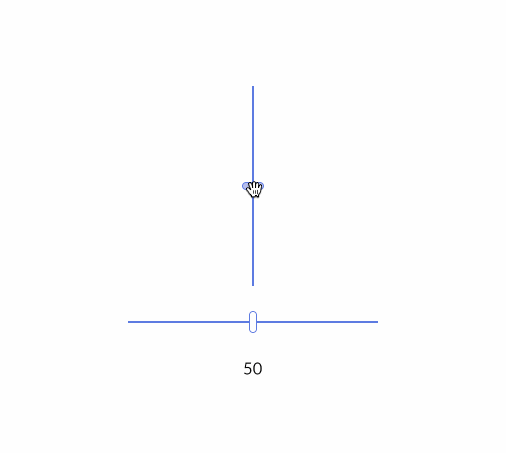

## Slider

A `Slider` is a bar and a handle that selects a single value from a range of values.
There exists both `Slider` and `VerticalSlider` depending on which orientation you need.

<div align="center">
    
</div>

You can run it with `cargo run`:

```
cargo run --package slider
```
