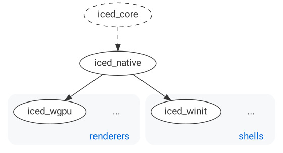

# `iced_glutin`
[][documentation]
[](https://crates.io/crates/iced_glutin)
[](https://github.com/iced-rs/iced/blob/master/LICENSE)
[](https://discord.gg/3xZJ65GAhd)

`iced_glutin` offers some convenient abstractions on top of [`iced_native`] to quickstart development when using [`glutin`].

It exposes a renderer-agnostic `Application` trait that can be implemented and then run with a simple call. The use of this trait is optional. A `conversion` module is provided for users that decide to implement a custom event loop.

<p align="center">
  
</p>

[documentation]: https://docs.rs/iced_glutin
[`iced_native`]: ../native
[`glutin`]: https://github.com/rust-windowing/glutin

## Installation
Add `iced_glutin` as a dependency in your `Cargo.toml`:

```toml
iced_glutin = "0.6"
```

__Iced moves fast and the `master` branch can contain breaking changes!__ If
you want to learn about a specific release, check out [the release list].

[the release list]: https://github.com/iced-rs/iced/releases
