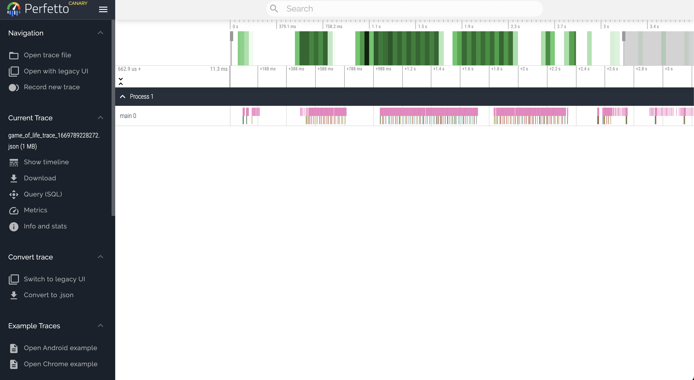

# `iced_profiling`
[]
[](https://crates.io/crates/iced_profiling)
[](https://github.com/iced-rs/iced/blob/master/LICENSE)
[](https://discord.gg/3xZJ65GAhd)

`iced_profiling` is a crate which implements various tracing backends for Iced.

It relies on the [tracing](https://crates.io/crates/tracing) crate to collect diagnostics. We currently only support 
tracing with `tracing`'s `info_span!` macro, but will consider different logging levels in the future. PRs welcome!

## Trace backends

We currently support only Chrome JSON traces using the [tracing-chrome](https://crates.io/crates/tracing-chrome) crate.

There are plans to add support for [Tracy](https://github.com/wolfpld/tracy) in the near future!

## Generating a trace file

### Using Iced's `Application`

Simply enable your tracing backend of choice (e.g. `trace_chrome`) feature in Iced & run your project.

```shell
cargo run --features iced/trace_chrome
```
### Standalone dependency

You can enable tracing by enabling your tracing backend of choice as a feature of `iced_profiling`.

```toml
iced_profiling = { version = "0.1.0", features = ["tracing-chrome"]}
```

Doing so will require you to initialize the profiler manually like so:

```rust
let _guard = iced_profiling::init();
```

This reference must be kept alive for the entire duration of your application that you wish to profile.

## Chrome

By default, Chrome trace files will be generated in the current working directory:
```shell
path/to/your/project/project_trace_{timestamp}.json
```

You also set a specific path by setting the `CHROME_TRACE_FILE` env variable:
```shell
CHROME_TRACE_FILE = ~/Desktop/trace.json cargo run
```

If you cannot find your trace file, there may have been a permission issue when trying to generate your file. Be sure to check your cargo manifest directory!

Once your file is generated, you can view it in Google Chrome at either [ui.perfetto.dev](ui.perfetto.dev) (new) or [chrome://trace](chrome://trace) (old).

<p align="center">
  
</p>