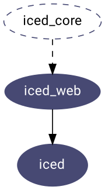

# `iced_web`
[][documentation]
[](https://crates.io/crates/iced_web)
[](https://github.com/hecrj/iced/blob/master/LICENSE)
[](https://iced.zulipchat.com)

`iced_web` takes [`iced_core`] and builds a WebAssembly runtime on top. It achieves this by introducing a `Widget` trait that can be used to produce VDOM nodes.

The crate is currently a __very experimental__, simple abstraction layer over [`dodrio`].



[documentation]: https://docs.rs/iced_web
[`iced_core`]: ../core
[`dodrio`]: https://github.com/fitzgen/dodrio

## Installation
Add `iced_web` as a dependency in your `Cargo.toml`:

```toml
iced_web = "0.1.0-alpha"
```

__Iced moves fast and the `master` branch can contain breaking changes!__ If
you want to learn about a specific release, check out [the release list].

[the release list]: https://github.com/hecrj/iced/releases
